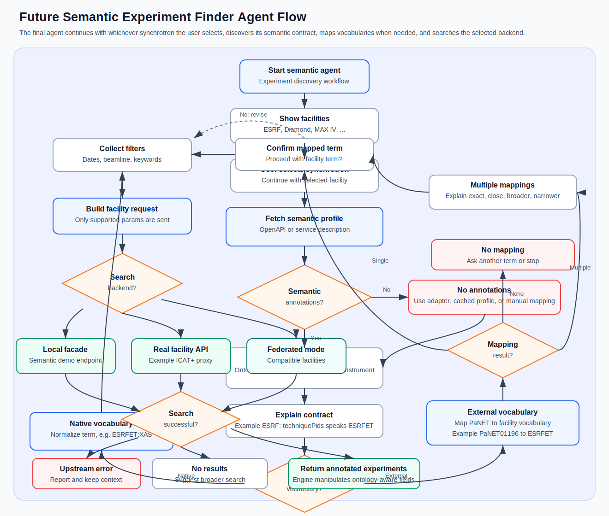
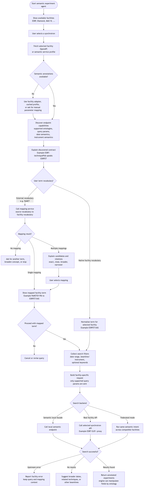
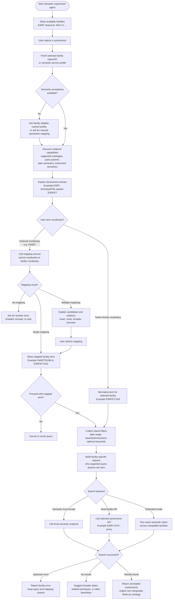

# Semantic Web Service POC

Local FastAPI demonstrator for an ESRF-style public datasets endpoint with semantic OpenAPI annotations.

## Run

```bash
python3 -m venv .venv
./.venv/bin/pip install -e ".[dev]"
./.venv/bin/uvicorn app.main:app --reload
```

Open Swagger UI at:

```text
http://127.0.0.1:8000/docs
```

## Endpoint

```http
GET /catalogue/public/datasets
```

Query parameters:

- `startDate` required ISO 8601 date-time
- `endDate` required ISO 8601 date-time
- `techniquePids` optional comma-separated technique IRIs
- `instrumentName` optional beamline or instrument name

Example:

```text
http://127.0.0.1:8000/catalogue/public/datasets?startDate=2024-01-01T00:00:00Z&endDate=2024-12-31T23:59:59Z&techniquePids=https://w3id.org/PaN/ESRFET%23XAS&instrumentName=ID21
```

## Semantic Annotations

The generated OpenAPI contract includes custom `x-*` annotations for the endpoint, parameters, and response fields. For example:

- `techniquePids` is annotated as `https://w3id.org/PaN/ESRFET#experimental_technique`
- `startDate` and `endDate` are annotated as `http://www.w3.org/2006/time#Instant`
- the service advertises supported vocabularies such as ESRFET, OWL-Time, XSD, DCAT, and schema.org

Inspect the raw OpenAPI at:

```text
http://127.0.0.1:8000/openapi.json
```

## Ontology Mapping Endpoint

```http
GET /map
```

Query parameters:

- `term` required PANET IRI, compact term, or local identifier
- `source` optional, defaults to `PANET`
- `target` optional, defaults to `ESRFET`

Example:

```text
http://127.0.0.1:8000/map?term=http://purl.org/pan-science/PaNET/PaNET01196
```

Example response:

```json
{
  "source": "PANET",
  "target": "ESRFET",
  "term": "http://purl.org/pan-science/PaNET/PaNET01196",
  "targetTerm": "http://purl.org/pan-science/ESRFET#XAS",
  "mappings": [
    {
      "sourceTerm": "http://purl.org/pan-science/PaNET/PaNET01196",
      "sourceCompact": "PaNET:PaNET01196",
      "targetTerm": "http://purl.org/pan-science/ESRFET#XAS",
      "targetCompact": "ESRFET:XAS",
      "targetLabel": "XAS",
      "relation": "owl:equivalentClass"
    }
  ]
}
```

The service loads `ontologies/ESRFET.owl` as an ontology model and queries it for `owl:equivalentClass` mappings. It does not string-scan the ontology file.

## Real ICAT+ Proxy Endpoint

```http
GET /icat/catalogue/public/datasets
```

This endpoint forwards to:

```text
https://icatplus.esrf.fr/catalogue/public/datasets
```

It only accepts and forwards the same four query parameters used by the local demonstrator endpoint:

- `startDate` required date in `YYYY-MM-DD` format
- `endDate` required date in `YYYY-MM-DD` format
- `techniquePids` optional comma-separated technique IRIs
- `instrumentName` optional beamline or instrument name

Example:

```text
http://127.0.0.1:8000/icat/catalogue/public/datasets?startDate=2024-01-01&endDate=2024-12-31&techniquePids=https://w3id.org/PaN/ESRFET%23XAS&instrumentName=ID21
```

## Prompt Agent

With the FastAPI server running, start the command-line demonstrator:

```bash
./.venv/bin/semantic-agent
```

The agent:

1. Shows three synchrotron options.
2. Uses the local ESRF option when selected.
3. Reads `http://127.0.0.1:8000/openapi.json`.
4. Explains that `/catalogue/public/datasets` advertises ESRFET, OWL-Time, XSD, DCAT, Dublin Core Terms, and schema.org annotations.
5. Asks whether to search with an ESRFET or PANET term.
6. Searches directly when given an ESRFET term such as `XAS` or `ESRFET:XAS`.
7. Calls `/map` to resolve PANET terms such as `PaNET01196` to ESRFET terms.
8. Asks whether to proceed with the mapped ESRFET term before searching the ESRF example service.

## Future Agent Flow Diagram




This diagram shows the intended end-state flow. In the real application, the agent continues with whichever synchrotron the user selects, discovers that facility's semantic contract, maps vocabularies when needed, and searches the selected backend. The diagram source is also kept as Mermaid in [docs/agent-flow.mmd](docs/agent-flow.mmd).



By default, the mapping service is expected at:

```text
http://127.0.0.1:8000/map
```

Override it with:

```bash
PANET_MAPPING_SERVICE_URL=http://127.0.0.1:9000/map ./.venv/bin/semantic-agent
```

Expected mapping service request:

```text
GET /map?source=PANET&target=ESRFET&term=<PANET_TERM>
```

Accepted response shapes include:

```json
{ "targetTerm": "http://purl.org/pan-science/ESRFET#XAS" }
```

or:

```json
{ "mappings": [{ "targetTerm": "http://purl.org/pan-science/ESRFET#XAS" }] }
```
